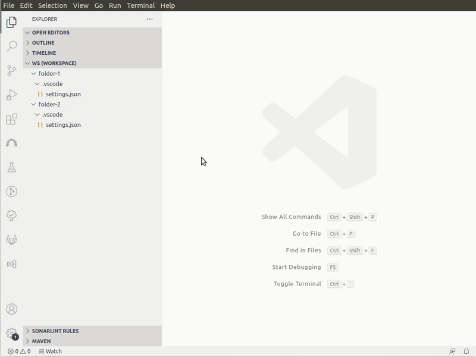
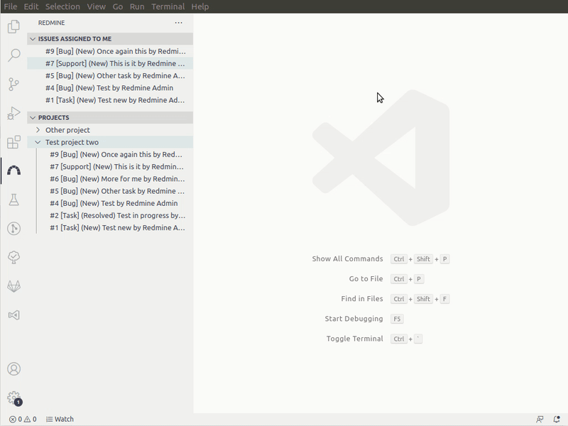
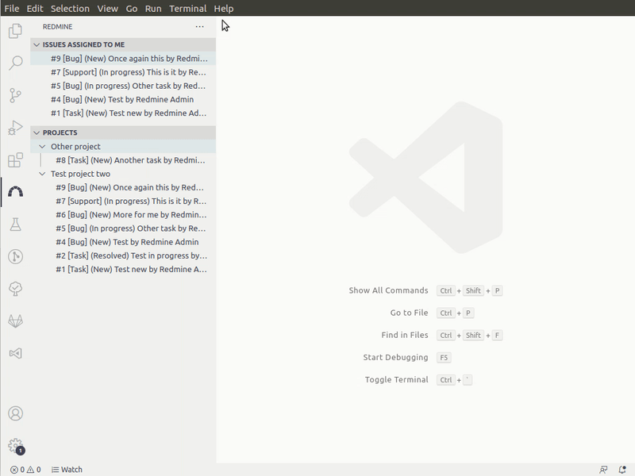

# `vscode-redmine`

Redmine extension for Visual Studio Code.

## Features

- Sidebar panel
  - List issues assigned to you in sidebar panel
  - List projects and open issues in them
- Create issue (opens redmine create issue in browser)
- List of issues assigned to you
- Open issue by id
- Open issue by selected number in document
- Issue actions:
  - Change status of an issue
  - Add time entry to an issue
  - Open issue in browser
  - Quick update issue

_Missing a feature? Open an issue and let me know!_

### Sidebar panel

### Add time entry from action menu

### Change server to other workspace folder in sidebar panel

## Requirements

It's required to enable REST web services in `/settings?tab=api` of your redmine (you have to be administrator of redmine server).

## Extension Settings

This extension contributes the following settings:

- `redmine.url`: URL of redmine server (eg. `https://example.com`, `http://example.com:8080`, `https://example.com:8443/redmine`, `http://example.com/redmine` _etc._)
- `redmine.apiKey`: API Key of your redmine account (see `/my/account` page, on right-hand pane)
- `redmine.rejectUnauthorized`: Parameter, which is passed to https request options (true/false) (useful to fix issues with self-signed certificates, see issue #3)
- `redmine.identifier`: If set, this will be the project, to which new issue will be created

  _NOTE: this is an identifier of project, not display name of the project_

- `redmine.additionalHeaders`: Object of additional headers to be sent along with every request to redmine server

## Contribution

If you want to contribute to the project, please read [contributing guide](./CONTRIBUTING.md) guide.

## Known Issues

No known issues yet. If you found one, feel free to open an issue!

## Release Notes

See [change log](./CHANGELOG.md)

## Attributions

### Logo

Logo is remixed version of original Redmine Logo.

Redmine Logo is Copyright (C) 2009 Martin Herr and is licensed under the Creative Commons Attribution-Share Alike 2.5 Generic license.
See http://creativecommons.org/licenses/by-sa/2.5/ for more details.

Made with ❤️ by [@rozpuszczalny](https://tomaszdomanski.com/?utm_source=github&utm_campaign=vscode-redmine)
